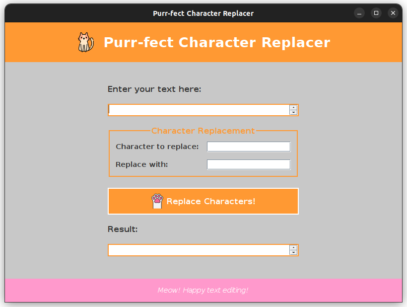
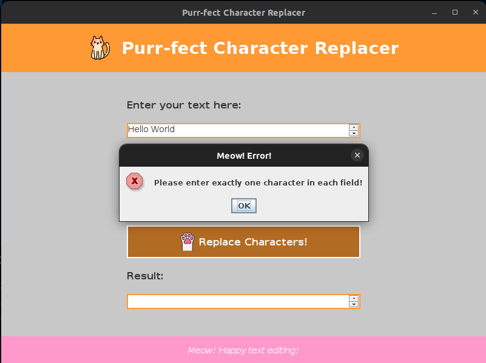
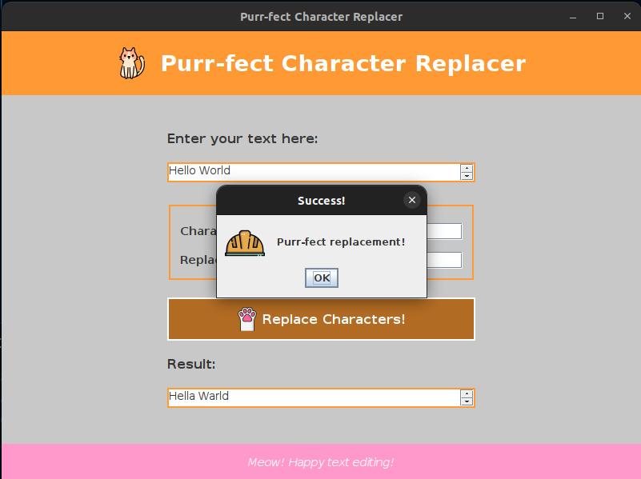
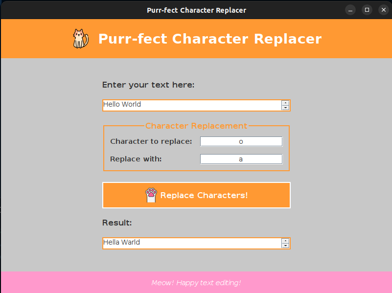

# Purr-fect Character Replacer

## About

A basic Java GUI program that lets you input a string of characters, then change a specific character with a single character of your choice. The program provides a simple interface to perform this function, allowing users to select the target character and the replacement character easily. It is designed to help you practice basic Java concepts, such as string manipulation, event handling, and GUI development.

And, most importantly, it includes cats!

## Screenshots









## How to Run The Program

### Prerequisites:
- Make sure you have Java installed on your system. You can download it from [Oracle's official website](https://www.oracle.com/java/technologies/javase-jdk15-downloads.html).
- A text editor or IDE (like [IntelliJ IDEA](https://www.jetbrains.com/idea/), [Eclipse](https://www.eclipse.org/), or [NetBeans](https://netbeans.apache.org/)) to edit and compile the Java file.
- Ensure the `javac` and `java` commands are accessible in your command line.

### Step-by-Step Instructions:

1. **Download/Clone the Project:**
   - If you haven't done so already, download or clone the project folder to your local machine.

2. **Open the Java File:**
   - Open **PurrfectCharacterReplacer.java** in your preferred text editor or IDE.

3. **Compile the Java File:**
   - If you're using a terminal or command line:
     1. Open your terminal (or Command Prompt on Windows).
     2. Navigate to the directory where the `PurrfectCharacterReplacer.java` file is located using the `cd` command:
        ```bash
        cd path/to/your/java/file
        ```
     3. Compile the Java file with the `javac` command:
        ```bash
        javac PurrfectCharacterReplacer.java
        ```
     4. If there are no errors, a `PurrfectCharacterReplacer.class` file will be generated in the same directory.

4. **Run the Program:**
   - To run the program, use the `java` command followed by the class name (without the `.class` extension):
     ```bash
     java PurrfectCharacterReplacer
     ```
   - This will launch the Java GUI application. Follow the on-screen instructions to input a string and replace characters.

5. **Enjoy the Program:**
   - The program will open a GUI that allows you to input a string of characters and select a specific character to replace with another of your choice.
   - Most importantly, enjoy the cat-themed interface!

### Note:

This is just a simple Java program that I made for my school activity. We were instructed to create a program that replace a specificed character with another character.
